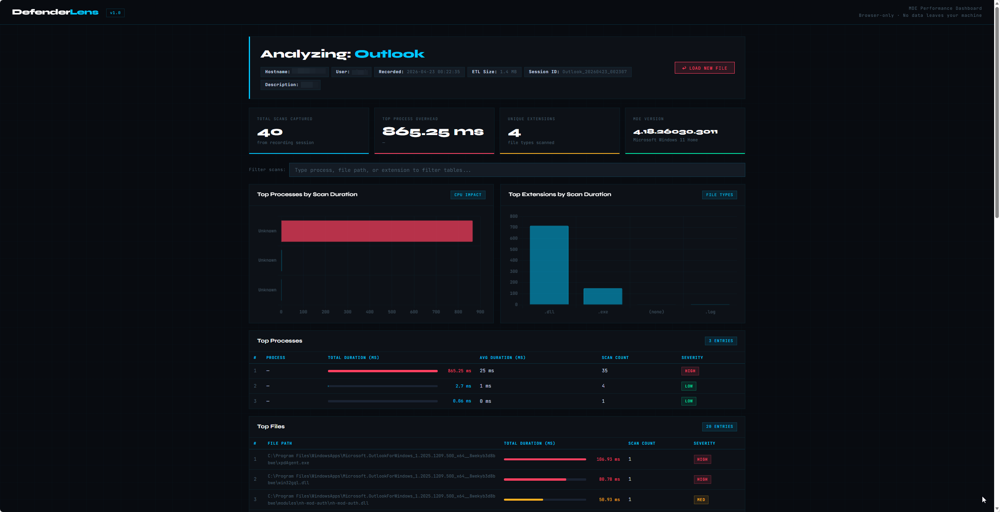

# DefenderLens 🔍

> **Browser-based MDE performance dashboard for IT security teams**  
> Identify which processes, files, and extensions are causing Microsoft Defender for Endpoint to spike CPU and RAM — no server, no installation, no data leaves your machine.



---

## What is DefenderLens?

DefenderLens is an open-source tool consisting of two parts:

- **`DefenderLens-Collector.ps1`** — A PowerShell script that runs on a Windows endpoint, records Microsoft Defender Antivirus scan activity using the built-in `New-MpPerformanceRecording` API, and exports the results as a structured JSON file.
- **`DefenderLens.html`** — A modern, single-file web dashboard that you open in any browser, drag-and-drop the JSON onto, and immediately get an interactive performance breakdown.

### Why does this exist?

When users report that an endpoint feels slow, the cause is often invisible: MDE's real-time protection scanning thousands of files per minute triggered by resource-heavy applications like Bloomberg Terminal, Outlook, or Excel. Windows Task Manager shows `MsMpEng.exe` spiking — but tells you nothing about *why*.

DefenderLens makes the invisible visible.

---

## Features

- Interactive process, file, and extension breakdown with scan duration bars
- Auto-generated analysis summary explaining what is happening and why
- Severity classification (HIGH / MED / LOW) based on relative scan overhead
- Live filter across all tables
- Session metadata: hostname, username, MDE version, OS
- Export-ready JSON for documentation and ticket evidence
- 100% browser-based — no backend, no npm, no install
- Works on any Windows 10/11 or Windows Server 2016+ endpoint with MDE

---

## Quick Start

### Step 1 — Collect data on the endpoint

Run PowerShell as **Administrator** on the affected machine:

```powershell
# If execution policy blocks the script:
PowerShell -ExecutionPolicy Bypass -File .\DefenderLens-Collector.ps1
```

The script will ask you:
1. Which application to analyze (e.g. `Outlook`, `Bloomberg`, `Excel`)
2. A description or ticket number (optional)
3. Recording mode: manual (press ENTER to stop) or timed (auto-stop after X seconds)

Use the application normally during the recording, then stop. The script exports a JSON file to `C:\Temp\DefenderLens\`.

### Step 2 — Open the dashboard

Open `DefenderLens.html` in any modern browser (Edge, Chrome, Firefox). Drag and drop the JSON file onto the landing page — or click **Browse File**.

No internet connection required. No data is uploaded anywhere.

---

## Files

| File | Description |
|------|-------------|
| `DefenderLens.html` | The web dashboard — open directly in any browser |
| `DefenderLens-Collector.ps1` | PowerShell collector script — run as Administrator on endpoint |
| `README.md` | This file |

---

## Requirements

### Collector script
- Windows 10, Windows 11, or Windows Server 2016+
- PowerShell 5.1 or later
- Microsoft Defender Antivirus version 4.18.2201.10 or later
- Must be run as Administrator

### Dashboard
- Any modern browser (Edge, Chrome, Firefox, Safari)
- No internet connection required after the page loads

---

## Use Cases

- **VDI / AVD migrations** — Validate VM sizing before rollout (e.g. D4ds v5 vs D8ds v5 for Bloomberg Terminal users)
- **Performance troubleshooting** — Identify which application is causing MDE to spike
- **Security operations** — Collect scan overhead evidence for change management or exclusion requests
- **Compliance documentation** — Export session data as evidence for audits

---

## Understanding the Output

### Unknown / kernel/system process names
If you see `kernel/system` in the process column, this is expected behavior. It means the scan was triggered by a Windows kernel driver or system-level operation rather than a user-mode process. The scan durations are still accurate — only the process attribution is unavailable.

### Severity ratings
Severity is calculated relative to the highest scan duration in the session:
- **HIGH** — more than 50% of the top scan duration
- **MED** — between 20% and 50%
- **LOW** — below 20%

### Duration values
All durations are reported in milliseconds. The cumulative total in the Analysis Summary represents the combined overhead MDE introduced during the recording window.

---

## Privacy

DefenderLens does not transmit any data. The JSON file is processed entirely in your browser using local JavaScript. No telemetry, no analytics, no external API calls.

The JSON file contains endpoint metadata (hostname, username, file paths). Handle it according to your organization's data classification policy.

---

## License

MIT License — free to use, modify, and distribute.  
See [LICENSE](LICENSE) for details.

---

## Contributing

Pull requests are welcome. If you find a bug or want to request a feature, open an issue.

Useful contributions:
- Support for additional MDE JSON field name variants across PS versions
- PDF export of the dashboard report
- Dark/light theme toggle
- Multi-session comparison view

---

## Author

Made with ❤️ in Norway/Europe by [@Cyb5r4Gene](https://github.com/Cyb5r4Gene)

> Built during real-world AVD migration work at a Norwegian financial institution, where Bloomberg Terminal users on Azure Virtual Desktop were experiencing MDE-related performance issues.

---

## Related Resources

- [Microsoft Defender Performance Analyzer — official docs](https://learn.microsoft.com/en-us/defender-endpoint/tune-performance-defender-antivirus)
- [New-MpPerformanceRecording reference](https://learn.microsoft.com/en-us/defender-endpoint/performance-analyzer-reference)
- [Morten Knudsen's blog post on MDE Performance Analyzer](https://mortenknudsen.net/?p=415)
